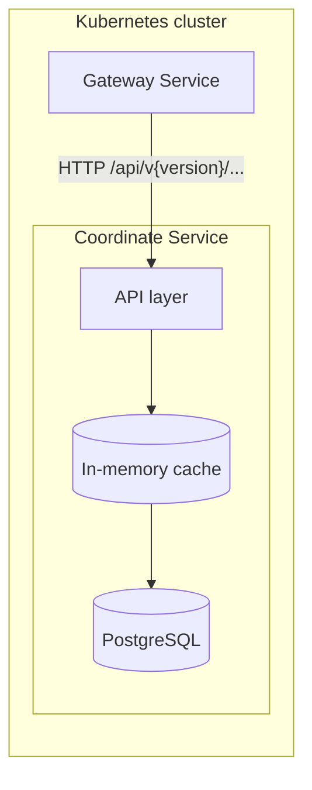
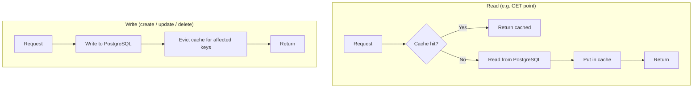

# Coordinate Service – Architecture

The service is intended to be called from a **gateway service** inside the cluster. Clients do not call the Coordinate Service directly; the gateway routes requests and may handle auth, rate limiting, and aggregation.

## Request flow (gateway → service → cache → PostgreSQL)

## Cache and database behaviour

**Read path:** API checks the cache first (by key, e.g. point:{id} or system:{id}). On cache miss, the service reads from PostgreSQL, stores the result in the cache, then returns the response.
**Write path (create/update/delete):** The service always writes to PostgreSQL first, then **evicts** the relevant cache entries so the next read sees fresh data from the database.

## How PostgreSQL is used

| Operation | PostgreSQL usage | Cache action |
|-----------|------------------|--------------|
| Create system | INSERT into coordinate_systems | None |
| Get system | SELECT from coordinate_systems | Set on miss |
| Delete system | DELETE + cascade | Evict system + all points |
| Create point | INSERT into points | Evict system |
| Get point | SELECT from points | Set on miss |
| Move point | UPDATE on points | Evict point + system |
| Delete point | DELETE from points | Evict point + system |

The service holds a single connection string (e.g. from ConnectionStrings:Postgres or env) and uses it for all operations. Schema is created on startup via InitializeAsync() (e.g. CREATE TABLE IF NOT EXISTS ...).
