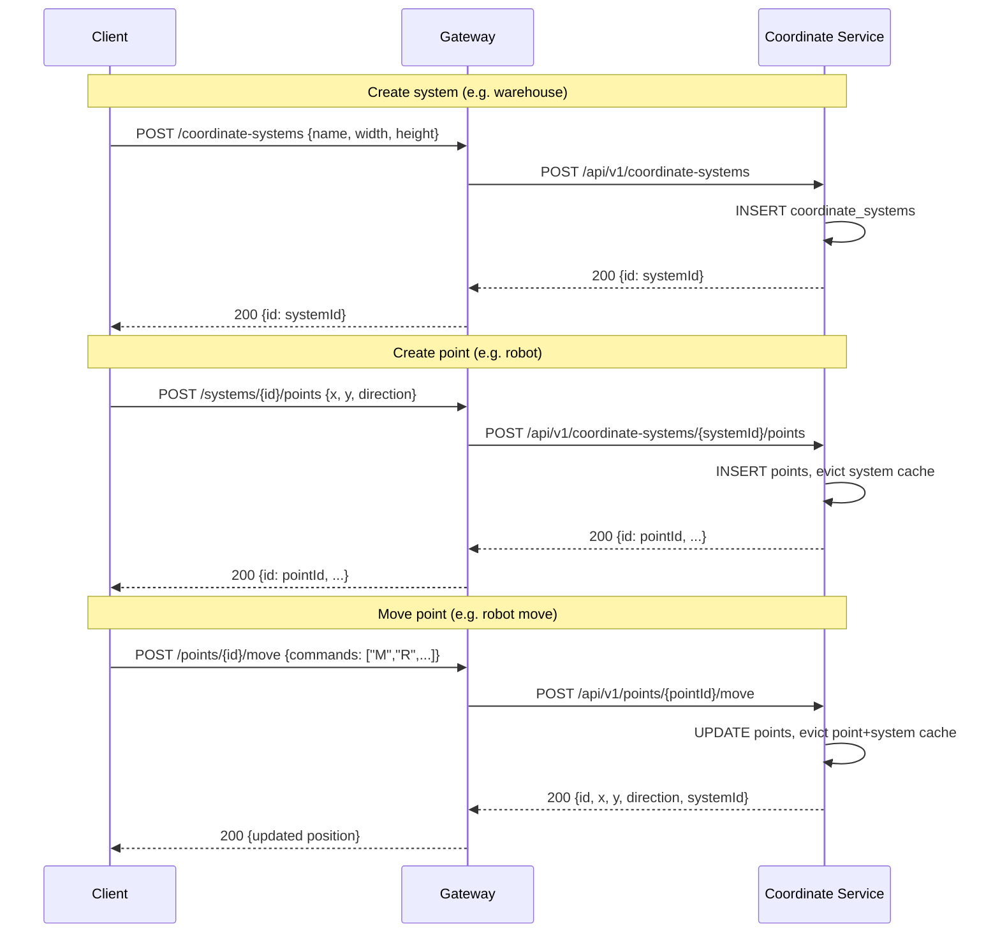
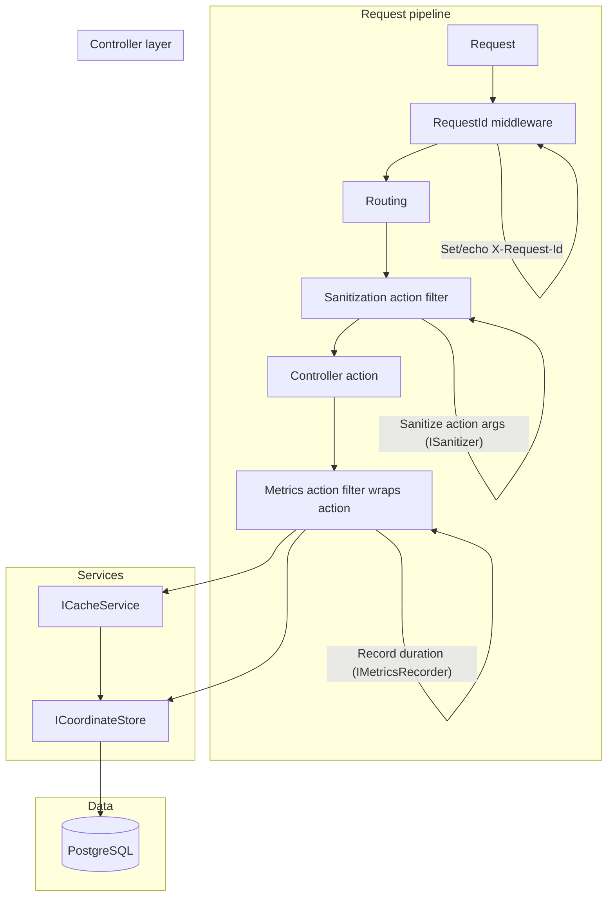
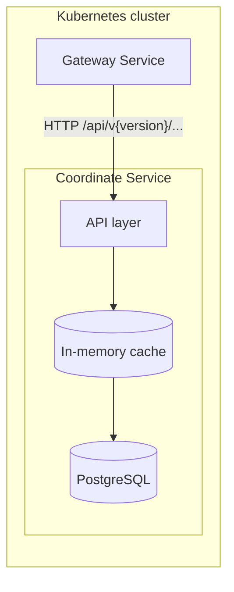
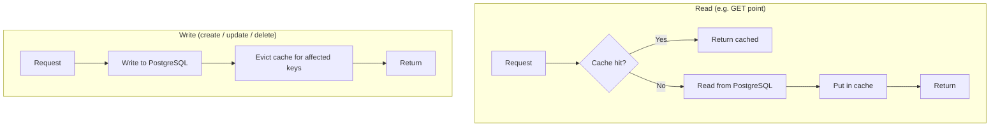

# Coordinate Service – Architecture

The service is intended to be called from a **gateway service** inside the cluster. Clients do not call the Coordinate Service directly; the gateway routes requests and may handle auth, rate limiting, and aggregation.

## Business context

- **Coordinate system** — Represents a bounded space, e.g. a **warehouse** (width × height grid). Each system has a unique id.
- **Point** — Represents a single movable entity in that space, e.g. a **robot** in the warehouse. Each point has position (x, y), facing direction (N/S/E/W), and is moved by commands (M=move, R/L=turn).
- The gateway (or other callers) create a system per warehouse, create a point per robot, and send move commands. The service is the source of truth for positions and boundaries.

## Gateway responsibilities

The gateway **mainly routes** traffic to the Coordinate Service. It can perform minimal, routing-related logic:

- **Check if a coordinate system exists** — Before sending point or move requests, the gateway may call `GET /api/v1/coordinate-systems/{id}` to ensure the system exists; if not, it can create it (e.g. `POST /api/v1/coordinate-systems`) so that subsequent point/move requests have a valid system. This keeps “ensure system exists” logic in one place and avoids the service having to infer creation from context.
- **Route by resource** — To reduce cross-pod cache inconsistency (see below), the gateway can route requests for the same resource (e.g. same `systemId` or `pointId`) to the same pod when possible (e.g. consistent hashing on resource id).

The gateway should **not** hold business logic beyond routing, light existence checks, and optional “create system if missing” to keep flows simple.

---

## Sequence diagram: common use cases

Create system → create point → move point (simplified; cache/DB not shown in sequence).

---

## Component interaction (middleware, filters, controllers, cache, DB)

Request flow through the service: middleware → routing → action filters (sanitization, metrics) → controller → store/cache → PostgreSQL.

- **RequestId middleware** — Runs first; reads or generates `X-Request-Id`, stores it in `HttpContext.Items`, and echoes it in the response header.
- **Sanitization filter** — Runs before the action; resolves `ISanitizer<T>` for each action argument and replaces arguments with sanitized values (e.g. trim strings, escape).
- **Metrics filter** — Wraps the action; records duration per operation (e.g. `PointsController.Move`) via `IMetricsRecorder` (e.g. console logging).
- **Controller** — Uses `ICacheService` for read-through cache and `ICoordinateStore` for all DB access; writes go to the store then evict cache.

---

## Request flow (gateway → service → cache → PostgreSQL)

## Cache and database behaviour

- **Read path:** API checks the cache first (by key, e.g. `point:{id}` or `system:{id}`). On cache miss, the service reads from PostgreSQL, stores the result in the cache, then returns the response.
- **Write path (create/update/delete):** The service always writes to PostgreSQL first, then **evicts** the relevant cache entries so the next read sees fresh data from the database.

## Multi-pod caching and routing

**Issue:** Cache is **in-memory per pod**. If Pod1 has cached a point and Pod2 handles a delete for that point, Pod1’s cache is not evicted. A later GET for that point routed to Pod1 could return the cached (now stale) data.

**Can gateway routing solve it?** Partially. If the gateway **routes all requests for the same resource** (e.g. same `pointId` or `systemId`) to the **same pod** (e.g. consistent hashing on resource id), then:

- All reads and writes for that resource hit the same pod.
- That pod’s cache is evicted on write, so subsequent reads on that pod see fresh data.

So: **routing by resource id (e.g. consistent hashing)** reduces the chance that one pod serves stale cache after another pod performed a write. It does not remove the need for eviction on write on the pod that handles the write; it only ensures that the pod that might serve a read is the same one that did the write. For full consistency across arbitrary routing, you’d need a shared cache (e.g. Redis) or no cache; for many deployments, resource-based routing is a simple and effective mitigation.

## How to get same resource → same pod (HttpClient vs gateway vs messaging)

### HttpClient and pods

**C# .NET `HttpClient` does not specify pods.** It sends requests to a **URL** (e.g. `https://gateway/...` or `https://coordinate-service`). The client has no notion of which Kubernetes pod will handle the request; that is decided by whatever sits in front of the service (Kubernetes Service, Ingress, or a custom gateway). So “same id → same pod” cannot be implemented inside the client by “choosing” a pod; it must be implemented by the **server-side** (gateway or proxy) that receives the request and forwards it.

**Ways to achieve same-resource-to-same-pod with HTTP:**

| Approach | How it works | Where it lives |
|----------|--------------|----------------|
| **Gateway consistent hashing** | Gateway (or sidecar) reads resource id from path or body (e.g. `pointId` from `/api/v1/points/{pointId}/move`). It hashes the id and selects a backend (e.g. one of N pod IPs or a subset of endpoints). All requests for that id go to the same pod. | Gateway / proxy code or config. |
| **Session affinity (sticky sessions)** | K8s Service or Ingress can use session affinity so the same *client* (e.g. same cookie or IP) hits the same pod. This is by client, not by resource id — so two different clients operating on the same point can still hit different pods. | K8s `sessionAffinity` or Ingress annotations. |
| **Custom header + affinity** | Gateway hashes the resource id and sets a header (e.g. `X-Backend-Key: {hash}`). Ingress or a proxy uses that header for affinity so the same key always goes to the same pod. | Gateway sets header; LB/Ingress uses it. |

So: **consumers of the Coordinate Service** use `HttpClient` to call the gateway (or service) URL; they do **not** “specify pods.” The gateway (or another layer) is responsible for routing by resource id same-id-to-same-pod.

### Message-based alternatives (NATS, etc.)

Instead of HTTP request–response its possible to use **messaging** so that “same resource id” naturally maps to the same processor (and thus, if you scale by consumer, to the same pod).

| Solution | Idea | Same resource → same consumer |
|----------|------|-------------------------------|
| **NATS** | Clients publish to **subjects** (topics), e.g. `coordinate.point.{pointId}.move`. **Queue groups** ensure one subscriber gets each message. You can design subjects so that all messages for a given `pointId` go to the same subject (or same queue group with a deterministic subscriber). NATS JetStream supports **consumers** and **streams**; you can bind consumption to a subject pattern. | Subject naming (e.g. `point.{pointId}.>`) or a single queue group with multiple subscribers and NATS’s delivery semantics. For strict “same pointId always to same consumer,” you’d typically need a **queue group per resource** or a router that subscribes to a wildcard and forwards by id to dedicated queues — or use a different system that partitions by key. |

**Summary:** With **HTTP**, the client cannot “specify pods”; the **gateway (or proxy)** must route by resource id (e.g. consistent hashing on path/body). With **messaging** (NATS, Kafka, RabbitMQ, Redis Streams), we can use **topics/subjects/partitions/routing keys** ) so that all messages for the same resource id are processed by the same consumer — and thus, when each consumer runs in one pod, by the same pod.

## How PostgreSQL is used

| Operation | PostgreSQL usage | Cache action |
|-----------|------------------|--------------|
| Create system | `INSERT` into `coordinate_systems` | None |
| Get system | `SELECT` from `coordinate_systems` | Set on miss |
| Delete system | `DELETE` + cascade | Evict system + all points |
| Create point | `INSERT` into `points` | Evict system |
| Get point | `SELECT` from `points` | Set on miss |
| Move point | `UPDATE` on `points` | Evict point + system |
| Delete point | `DELETE` from `points` | Evict point + system |

The service holds a single connection string (e.g. from `ConnectionStrings:Postgres` or env) and uses it for all operations. Schema is created on startup via `InitializeAsync()` (e.g. `CREATE TABLE IF NOT EXISTS ...`).
